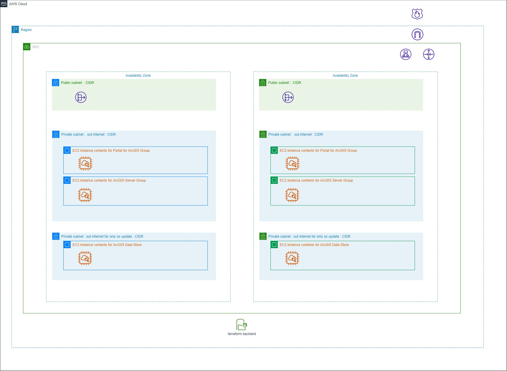
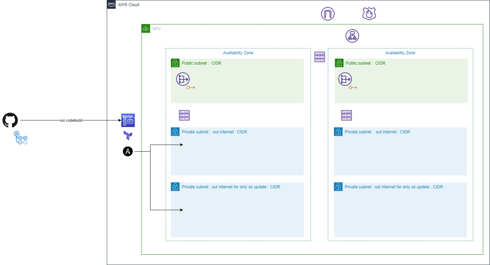
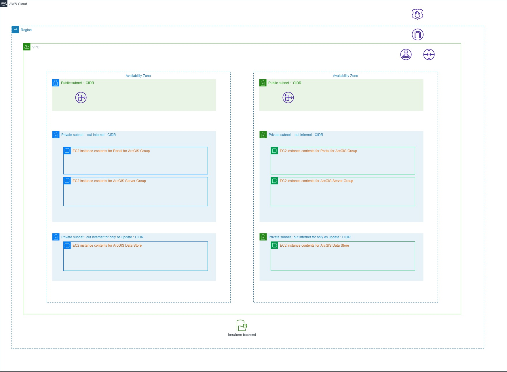

# Web GIS Sytem deployment using ArcGIS Enterprise, Terraform and Ansible

This project is to deploy ArcGIS Enterprise base deployment on AWS automatically using Terraform and Ansible. The current deployment code can create the following system:



The architecture model is based on blue-green. (or active-cold/active-passive).

# Feature

The automation to deploy ArcGIS Enterprise is based on Terraform and Ansible.
The goal of this project is to be able to scrap-build of ArcGIS Enterprise System again and again even if the system is broken or too time to fix issues at system.
The webgisdr tools help you back up the system and restore it.

See the [Restore the backup](./README-RESTORE.md)

Also I try to use only Route53 private dns in this project to resolve machines.

The automation workflow diagram is:


As the workflow diagram, I choose GitHub Action and AWS Codebuild to deploy ArcGIS Enterprise Web System.

GitHub Action is used for only to run AWS codebuild because you can check the logs through only GitHub Action. Not need to access aws console.
AWS Codebuild is used for running terraform and ansible provisioning because the provisioning target nodes is deployed in a private subnets.

Also You can use only ansible provisioner with your local instance.

**NOTE: You can also use this provisioning project in other environment which can access to your aws.**

# Requirement

* Prepare goldenimages which each ArcGIS Enterprise components.

	I create other repository for [arcgis-goldenimage](https://github.com/atzhit7/arcgis-goldenimage).

	This project is designed with that goldenimages created with that repository. But the currently install directory and content directory is given from registry key(Windows). So you may use [Esri providing images](https://aws.amazon.com/marketplace/seller-profile?id=98a100e1-04d1-40b2-aa8a-619411d037d2).

	Prepare some passwords as [portal initial user and server site admin user password](#portal-initial-user-server-site-admin-user-self-server-certificate-passwords-management)

* Prepare your Domain (ie. hogehoge.io)

# Usage

This project has two phase:

* [AWS provisioning by Terraform](#aws-provisioning-by-terraform)

* [ArcGIS Enterprise provisioning by Ansible](#arcgis-enterprise-provisioning-by-ansible)

After prepare all vaiables, all phases can be run automatically through [GitHub Action and Codebuild](#github-actions-and-aws-codebuild-options).

At first, prepare all variables for this projects.

## AWS provisioning by Terraform

### For the Infrastructure hosting ArcGIS Instances.

The terraform code in "**infra**" directory create the following resources where ArcGIS Instances are deployed:

* vpc
* subnets
* route 53
* alb
* security group
* system manager (ec2 iam role, instance profile and others)
* S3 buckets



1. Edit the provider.tf under **envs** directory.

This is used as Terraform provider file for "**infra**".

**NOTE: I create symbolic link provider.tf with local_provider.tf or provider.tf to under "**envs**" directory. "local_" prefix is for when running terraform on the local machine. The difference is only if having "profile" parameter or not.**

Edit the default tags if needed.

If you run the terraform from your local, please also edit local_provider.tf.

**NOTE: if you want to switch the Terraform runner Codebuild or Local, use the wrapper Makefile.**

---
2. Modify the backend.tf for your aws.

**NOTE: backend.tf is a simbolic link to local_infra_backend.tf or infra_backend.tf under blue directory. "local_" prefix is for when running terraform on the local machine.**

**NOTE: "infra_backend.tf" is for [AWS Codebuild Option](#GiHub-Actions-and-AWS-CodeBuild-Options). The difference is only if having "profile" parameter or not. Then I prepare the wrapper Makefile to switching local or codebuild.**

---
3. create variable files "terraform.tfvars" for variable.tf.

```
name      = "YOUR SYSTEM NAME"
region    = "WHERE TO DEPLOY"
vpc_cidr  = "SUBNET CIDR BLOCK ie. 10.10.0.0/16" -> public subnet*1 private subnet*2 in each az
domain    = "YOURROOTDOMAIN"
blue_subdomain = "THE INTERNAL SUBDOMAIN FOR YOUR BLUE-DEPLOYMENT"
green_subdomain = "THE INTERNAL SUBDOMAIN FOR YOUR GREEN-DEPLOYMENT"
arcgisserver_prefix    = "ARCGIS SERVER INSTANCE IDENTICAL PREFIX"
arcgisportal_prefix    = "PORTAL FOR ARCGIS INSTANCE IDENTICAL PREFIX"
arcgisdatastore_prefix = "ARCGIS DATA STORE INSTANCE IDENTICAL PREFIX"
```

**NOTE: In my GitHub Action, I posted this terraform.tfvars data to your parameter store. My .gitignore is having .tfvars for security incident.**

```aws ssm put-parameter --name "PATH" --type String --value "$(cat terraform.tfvars)" --profile YOURPROFILE --region REGION --overwrite```

### For the ArcGIS Enterprise instances.

4. prepare Terraform files and varibles as well under app/blue and app/green as well as "**infra**".

* terraform.tfvars
```
name                   = "YOUR BLUE SYSTEM NAME"
instance_type          = "INSTANCE TYPE YOU WANT TO USE" 
key_name               = "KEY PAIR NAME PREFIX"
```

**NOTE: In my GitHub Action, I posted this terraform.tfvars data to your parameter store. My .gitignore is having .tfvars for security incident.**

```aws ssm put-parameter --name "PATH" --type String --value "$(cat terraform.tfvars)" --profile YOURPROFILE --region REGION --overwrite```

* backend.tf

**NOTE: I create symbolic link file "backend.tf" with local_blue/gree_backend.tf or blue/gree_backend.tf to  under blue directory. "local_" prefix is for when running terraform on the local machine. The difference is only if having "profile" parameter or not. If you want to switch the Terraform runnner Codebuild or Local, use the wapper Makefile.**

* provider.tf

Provider symbolic link is the same as "**provider.tf**" under "**envs**" directory.

* remotestate.tf

Modify to refer the "**infra**" remotestate.

ArcGIS Enterprise blue/green environments are deployed on "**infra**", so the "**infra**" remotestate is used during deploying. 
[But Hashicorp does not recommend to use remote state for variables.](https://www.terraform.io/language/state/remote-state-data)

**NOTE: The symbolic link file "remotestate.tf" with remotestate.tf or local_remotestate.tf under app directory. "local_" prefix is for when running terraform on the local machine. The difference is only if having "profile" parameter or not. If you want to switch the Terraform runnner Codebuild or Local, use the wapper Makefile.**


* output.tf

output create also variable file for Ansible and password managements at parameter store.

```
data "aws_kms_secrets" "parameters" {
  secret {
    name    = "servercert_password"
    payload = "PAYLOAD FOR SERVER CERTIFICATION PASSWORD"
  }
  secret {
    name    = "portaladmin_password"
    payload = "PAYLOAD FOR PORTAL INITIAL USER PASSWORD"
  }
  secret {
    name    = "serveradmin_password"
    payload = "PAYLOAD FOR SERVER ADMIN USER PASSWORD"
  }
}
```


---
5. Modify the AMI image filter in varibales.tf with your image installed ArcGIS Enterprise components.

**NOTE: I have [another repository](https://github.com/athit7/arcgis-goldenimage) to create a golden image AMI having ArcGIS Enterprise components. This project is designed to use that golden image ami.**

```
data "aws_ami" "arcgisserver" {
  most_recent = true
  name_regex  = "REGEX TO FILTER AMI ARCGIS SERVER INSTALLED"
  owners      = ["self"]
  filter {
    name = "tag:TAG (IF YOU SET ANY TAGS)"
    values = ["TAG VALUE"]
  }
}
data "aws_ami" "arcgisportal" {
  most_recent = true
  name_regex  = "REGEX TO FILTER AMI PORTAL FOR ARCGIS INSTALLED"
  owners      = ["self"]
  filter {
    name = "tag:TAG (IF YOU SET ANY TAGS)"
    values = ["TAG VALUE"]
  }
}
data "aws_ami" "arcgisdatastore" {
  most_recent = true
  name_regex  = "REGEX TO FILTER AMI ARCGIS DATA STORE INSTALLED"
  owners      = ["self"]
  filter {
    name = "tag:TAG (IF YOU SET ANY TAGS)"
    values = ["TAG VALUE"]
  }
}
```

---
6. prepare Terraform files and varibles for front end setting.

The "front" directory is for for only alb settings to switch blue/green deployment.

* terraform.vars corresponding with the variables.tf.

```
name      = "yoursystemname"
target    = "blue"
```

**NOTE: In my GitHub Action, I posted this terraform.tfvars data to your parameter store. My .gitignore is having .tfvars for security incident.**

```aws ssm put-parameter --name "PATH" --type String --value "$(cat terraform.tfvars)" --profile YOURPROFILE --region REGION --overwrite```

* remotestate.tf

**NOTE: The symbolic link file "remotestate.tf" with infra_app_remotestate.tf or local_infra_app_remotestate.tf under app directory. "local_" prefix is for when running terraform on the local machine. The difference is only if having "profile" parameter or not. If you want to switch the Terraform runnner Codebuild or Local, use the wapper Makefile.**

* backend.tf

**NOTE: I create symbolic link file "backend.tf" with local_front_backend.tf or front_backend.tf to  under blue directory. "local_" prefix is for when running terraform on the local machine. The difference is only if having "profile" parameter or not. If you want to switch the Terraform runnner Codebuild or Local, use the wapper Makefile.**


## ArcGIS Enterprise provisioning by Ansible

## Ansible global variables (icnluding DNS settings and initial admin user information.) and inventory file.

After deploying blue/green instances, the global variable file, inventory file and createportal property file for ansible are created under ansible directory and s3 bucket according to your deployment. Check "output.tf" under blue/green directory.

**ISSUE: almost configuration is script-based provisioning, currently idempotent is less.This project is designed to be destroyed and rebuilt as often as possible. Please back up with [webgisdr tool](https://enterprise.arcgis.com/en/portal/latest/administer/linux/create-web-gis-backup.htm).**

**NOTE: the instances is located at private subnet without internet comming. So please run ansible project where can access to these instances. For this limitation, I choise the aws codebuild.**

### Ansible variables for ArcGIS Enterprise

1. Change directory to app/ansible directory and modify variable file for each instances(ArcGIS Server/ArcGIS Data Store/Portal for ArcGIS).

    * vars_arcgisdatastore.yaml
		
    **NOTE: Currently, relation and tileCache can be configured for the basedeployment.**
    		
    ```yaml
    arcgisports:
      - 2443
      - 9876
      - 29080
      - 29081
    choices_datastore_types: "relational,tileCache"
    win_datastore_dir: DATA STORES(relational, tilecache or others) LOCATION
    ```
    
    * vars_arcgisserver.yaml

    "win_server_dir" and "win_config_store_dir" parameters should be changed at least for the target instance.

    ```yaml
    win_server_dir: SERVICE DIRECTORY
    win_config_store_dir: CONFIG DIRECTORY
    ```

    * vars_arcgisportal.yaml

    The install directory and config store directory are from system(registry). So there are no paramters to modify. If you want to change config store location "win_portal_dir", set the directory according to the instance settings.

		* vars_global.tmpl at /data directory

		This variables are created at Terraform deployment and may be used at some tasks. So I separate the variable files.
		After running the apply of terraform, the vars_global.yaml is created at the "ansible" directory.

2. ansible playbook commands

    ```
    ansible-playbook -i ./inventory ./arcgisserver.yaml
    ansible-playbook -i ./inventory ./arcgisdatastore.yaml
    ansible-playbook -i ./inventory ./arcgisportal.yaml
    ansible-playbook -i ./inventory ./federation.yaml
    ```

    Run the playbooks in this order.

    ArcGIS Data Store configuration require ArcGIS Site.

    The reason why to preapare "federation" role is to be able to federate with another role ArcGIS Server instance.

    **NOTE: inventory file is created from terraform. The template file is located at /data directory.And also vars_global.yaml for global variables for provisioning is created from terraform.**

## GitHub Actions and AWS CodeBuild Options

You can find GitHub Action to run codebuild project under github/workflow directory.
And also you can find aws codebuild's buildspec files under **envs/codebuild/configuration** directory.

If using Github Action and AWS Codebuild, prepare the following.

1. Prepare all variables such as provider.tf, backend.tf, remotestate.tf for **infra**, **app/blue**, **app/green**, **app/front** and ansible role variables which are described as above.

2. Commit and push them

3. Prepare the terraform.tfvars under **infra**, **blue**, **green**, **front** and Put the terraform.tfvars to your SSM Parameter Store.

3. Register your AWS account id under GitHub Action Secret.

    This is needed for running codebuild using the assume role through oidc.

    [Reference](https://docs.github.com/ja/actions/deployment/security-hardening-your-deployments/configuring-openid-connect-in-amazon-web-services)

4. Prepare the Codebuild Project

5. Configure your workflow environments.

    * [dev-arcgis-system-deploy-infra.yaml](.github/workflows/dev-arcgis-system-deploy-infra.yaml)

    This is for **infra** deployment. You must run this workflow.

    ```
    env:
        AWS_REGION: YOUR DEPLOY TARGET AWS REGION
        AWS_ROLE_ARN: OIDC ASSUME ROLE ARN
        ROLLE_SESSION_NAME: SESSION NAME
        CODEBUILD_PROJECT_NAME: ${{ secrets.AWS_CODEBUILD_PROJECT }}
    ```

    * [dev-arcgis-system-deploy-app-jobs.yaml](.github/workflows/dev-arcgis-system-deploy-app-jobs.yaml)

    This is for deploy and provisioning ArcGIS Enterprise.
    This workflow calls the below workflows about **blue**, **green** and **front** deployment because of the session time.

    ```
    env:
        AWS_REGION: YOUR DEPLOY TARGET AWS REGION
        AWS_ROLE_ARN: OIDC ASSUME ROLE ARN
        ROLLE_SESSION_NAME: SESSION NAME
        CODEBUILD_PROJECT_NAME: ${{ secrets.AWS_CODEBUILD_PROJECT }}
        DEPLOY_SUBDOMAIN: ${{ github.event.inputs.subdomain }}
        DEPLOY_PURPOSE: ${{ github.event.inputs.deploypurpose }}
        SWITCH_TARGET: ${{ github.event.inputs.switchtarget }}
    ```

    **NOTE: In my design, the deploy_subdomain env is used also as terraform workspace. The workspace is registerred at Route53 DNS. So please do not use under score variable. In my testing, I prepared golden image for dev and use deploy_purpose env is used in ami filter. Switch_target env is for switching blue/green user access. The environments meaning is as the same as each workflow.**

    * [dev-arcgis-system-deploy-app-blue.yaml](.github/workflows/dev-arcgis-system-deploy-app-blue.yaml)
and [dev-arcgis-system-deploy-app-green.yaml](.github/workflows/dev-arcgis-system-deploy-app-green.yaml)
    
    ```
    env:
        AWS_REGION: YOUR DEPLOY TARGET AWS REGION
        AWS_ROLE_ARN: OIDC ASSUME ROLE ARN
        ROLLE_SESSION_NAME: SESSION NAME
        CODEBUILD_PROJECT_NAME: ${{ secrets.AWS_CODEBUILD_PROJECT }}
        DEPLOY_SUBDOMAIN: ${{ github.event.inputs.subdomain }}
        DEPLOY_PURPOSE: ${{ github.event.inputs.deploypurpose }}
    ```
    
    * [dev-arcgis-system-deploy-app-front.yaml](.github/workflows/dev-arcgis-system-deploy-app-front.yaml)

    ```
    env:
        AWS_REGION: YOUR DEPLOY TARGET AWS REGION
        AWS_ROLE_ARN: OIDC ASSUME ROLE ARN
        ROLLE_SESSION_NAME: SESSION NAME
        CODEBUILD_PROJECT_NAME: ${{ secrets.AWS_CODEBUILD_PROJECT }}
        DEPLOY_SUBDOMAIN: ${{ github.event.inputs.subdomain }}
        SWITCH_TARGET: ${{ github.event.inputs.switchtarget }}
    ```

6. Check the AWS Codebuild specs.

Each GitHub Action workflows call AWS Codebuild.

The codebuild specs are:

* [buildspec_deploy_infra.yaml](./envs/codebuild/configuration/buildspec_deploy_infra.yaml)

    Change the ssm paramter of terraform.tfvars for your case.

* [buildspec_deploy_provisioning_blue.yaml](./envs/codebuild/configuration/buildspec_deploy_provisioning_blue.yaml)

    Change the ssm paramter of terraform.tfvars for your case.

* [buildspec_deploy_provisioning_green.yaml](./envs/codebuild/configuration/buildspec_deploy_provisioning_green.yaml)

    Change the ssm paramter of terraform.tfvars for your case.

* [buildspec_deploy_front.yaml](./envs/codebuild/configuration/buildspec_deploy_front.yaml)

    Change the ssm paramter of terraform.tfvars for your case.

**NOTE: At this time, I does not create Docker file for this deployment.**

## Run testing action using [act](https://github.com/nektos/act)

1. Prepare the action yaml with trigger on push under .github/workflow/.

    1. copy the exisiting action yaml.
    2. edit the environments info (with Upper cases) and change the "push" trigger to run.
    
        ```yaml
        on:
            push:
        
        env:
            # set with your preferred AWS region, e.g. us-west-1
            AWS_REGION: ap-southeast-2
            # set with GitHub Actions role name but the following two variables are not used at ACT
            AWS_ROLE_ARN: arn:aws:iam::${{ secrets.AWS_ACCOUNT_ID }}:role/github-action-to-ec2
            ROLLE_SESSION_NAME: GithubAction-PackerBuild
            # set your codebuild project name
            CODEBUILD_PROJECT_NAME: deploy-run-through-ghaction
            DEPLOY_SUBDOMAIN: cust1
            DEPLOY_PURPOSE: dev
            SWITCH_TARGET: blue
        ```

    3. comment out the following actions for unexepted error.

        '- name: check if there is a crash log with unexcepted error'

        '- name: Error handling'

        NOTE: The docker image I tested does not find powershell core.

2. type the following key.

    `act -s AWS_ACCESS_KEY_ID=YOURKEY -s AWS_SECRET_ACCESS_KEY=YOURSECRETKEY`

    You can also use an act parameter file including the aws keys.

## Portal initial user, Server Site admin user, self server certificate passwords management

1. Change the directory keyman directory
1. Run terraform commands

    ```
    terraform init
    terraform plan
    terraform apply
    ```
    
    You can create a new key.

1. Encrypt your portal initial user password, server site admin user password and server certification password.

    ```
    aws kms encrypt --key-id YOURKEYID --plaintext PORTALADMINPASSWORD
    aws kms encrypt --key-id YOURKEYID --plaintext SERVERSITEADMINPASSWORD
    aws kms encrypt --key-id YOURKEYID --plaintext SERVERCERTPASSWORD
    ```

    You can get the payloads for each passwords.

    Set them under blue/green output.tf.
    Then these values are used in your deployment.

## Knowledge for ArcGIS Enterprise deployment at aws with route53

This system deployment is designed to resolve each machines with route53 because of reduce the dependency of hostname and ips.

So each instance has two fqdns.
To resolve the machine with route53 fqdn, Portal for ArcGIS/ArcGI Server/ArcGIS Data Store need to have the hostname.properties or hostidentifier.properties.

See the following:
[Configure in advanced scenarios](https://enterprise.arcgis.com/en/server/latest/deploy/windows/multiple-nic-cards-dns-entries.htm)

In this case, this senerio is applied.

Issue without no properties:
* ArcGIS Server machine name is back to machine name after restarting service, and affect the machine infomation is applied to ArcGIS DataStore configuration even if editing these information at rest api.
Then arcgis datastore validation will be failed.

* tilecache web server endpoint certificate is created at hostname and we have to replace them manually through couchdb utils.